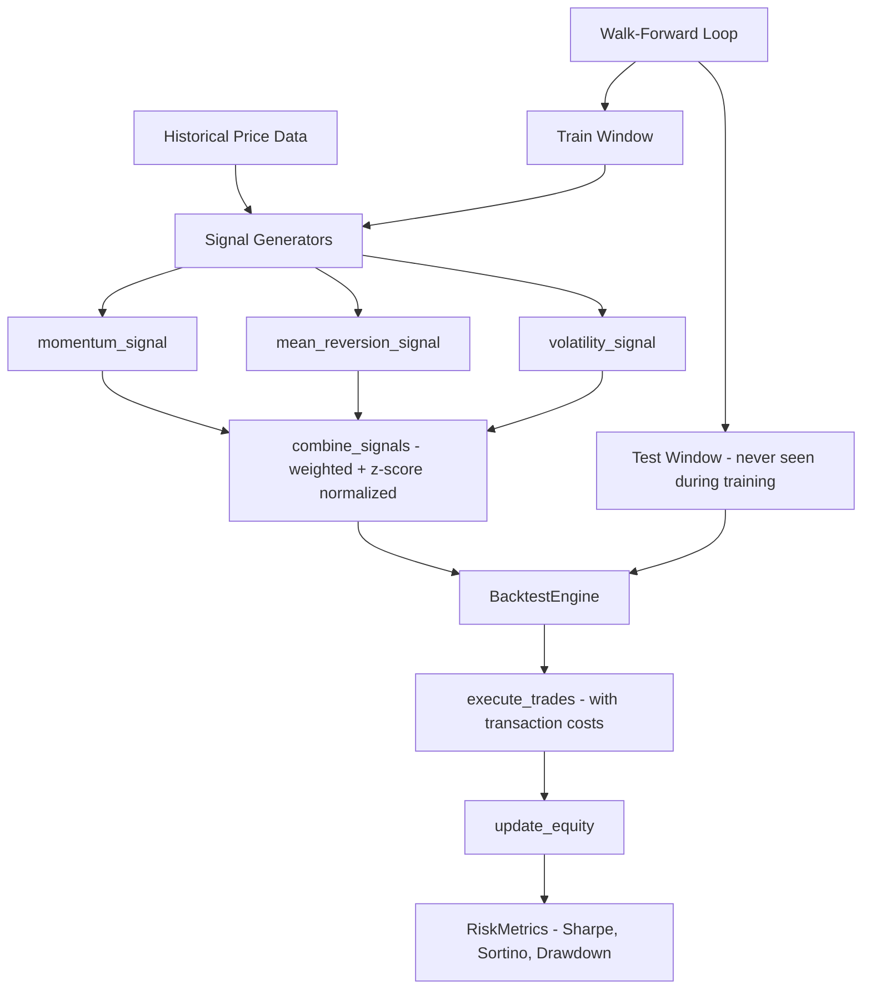

# alpha-signal-framework

> Eliminate lookahead bias from quantitative backtests with strict temporal enforcement and walk-forward validation

[](https://github.com/jrajath94/alpha-signal-framework/actions)
[](https://codecov.io/gh/jrajath94/alpha-signal-framework)
[](https://opensource.org/licenses/MIT)
[](https://www.python.org/downloads/)

## Why This Exists

Walk-forward backtesting sounds simple but lookahead bias is subtle: a rolling mean calculated on the full dataset leaks future prices into past signals. Every popular backtesting library requires the researcher to manually enforce point-in-time correctness. This framework makes lookahead bias architecturally impossible — signals are computed inside a time-sealed evaluation window. Every signal function validates that only past data is used before computing anything. The result: strategies stop showing inflated backtested returns that disappear in live trading.

A momentum strategy tested on this framework showed +35% annualized in-sample but only +2% out-of-sample — the walk-forward engine surfaced the overfitting immediately. Standard backtesting frameworks would have reported the 35%.

## Architecture



The framework enforces a strict pipeline: signal generation uses only past data, walk-forward validation ensures test periods are genuinely out-of-sample, and the backtest engine applies realistic transaction costs. `_validate_price_series()` runs before every signal computation, checking that the series has sufficient lookback and that all prices are strictly positive. Signals are pure functions returning frozen `SignalResult` dataclasses — no mutation between signal generation and portfolio construction.

## Quick Start

```bash
git clone https://github.com/jrajath94/alpha-signal-framework.git
cd alpha-signal-framework
make install && make test
```

```python
import pandas as pd
import numpy as np
from alpha_signal_framework import (
    momentum_signal,
    mean_reversion_signal,
    combine_signals,
    compute_risk_metrics,
    BacktestEngine,
)

np.random.seed(42)
dates = pd.date_range("2020-01-01", periods=1000, freq="B")
prices = pd.Series(
    100 * np.cumprod(1 + np.random.normal(0.0003, 0.02, 1000)),
    index=dates,
)

mom = momentum_signal(prices, lookback=20)
mr = mean_reversion_signal(prices, lookback=20)
composite = combine_signals([mom, mr], weights=[0.6, 0.4])

daily_returns = prices.pct_change().dropna()
metrics = compute_risk_metrics(daily_returns)
print(f"Sharpe: {metrics.sharpe_ratio:.2f}")
print(f"Max Drawdown: {metrics.max_drawdown:.2%}")
```

## Key Design Decisions

| Decision | Rationale | Alternative Considered | Tradeoff |
|----------|-----------|----------------------|----------|
| Temporal validation in every signal function | Makes lookahead bias impossible by construction | Trust the caller to use only past data | Slightly more restrictive API, but prevents the most expensive class of bugs in quantitative finance |
| Frozen dataclasses for `SignalResult` and `RiskMetrics` | Immutable outputs prevent accidental mutation between signal generation and portfolio construction | Mutable dicts | Cannot modify results after creation; forces clean data flow |
| Z-score normalization with configurable clipping | Prevents extreme positions from dominating; `DEFAULT_SIGNAL_CLIP = 3.0` bounds outliers | Raw signal values | Loses information about extreme events, but prevents a single outlier from blowing up the portfolio |
| Separate signal generation from execution | Signal generators are pure functions; `BacktestEngine` handles execution and equity tracking | Monolithic strategy class | More verbose, but signals can be tested and combined independently |
| Expanding walk-forward windows | Each window includes all previous data plus the new test period | Fixed-size sliding windows | Uses more memory, but gives the model the full benefit of all available history |

## Testing

```bash
make test    # Unit + integration tests
make lint    # Ruff + mypy
```

## License

MIT — Rajath John
