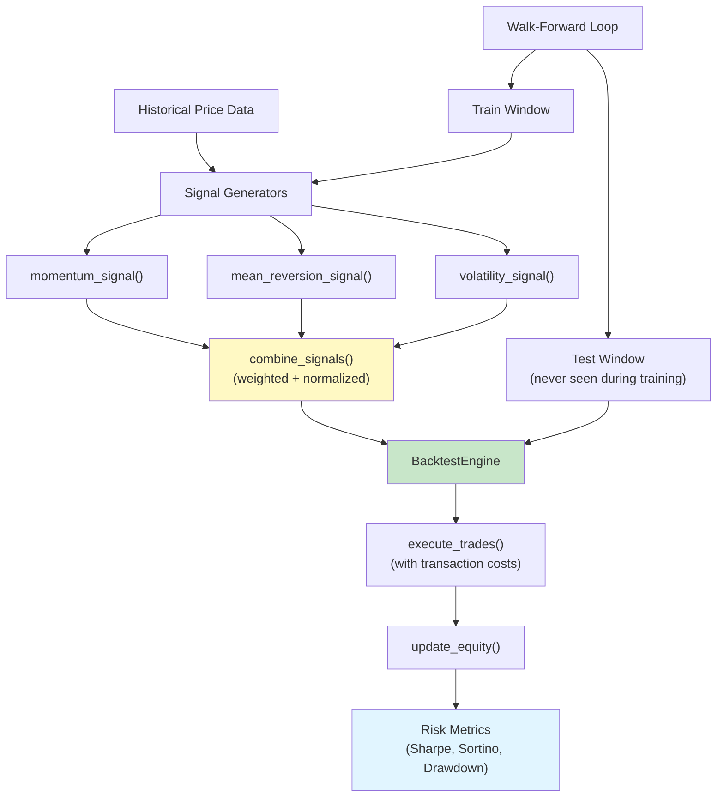

# alpha-signal-framework

> Eliminate lookahead bias from quantitative backtests with strict temporal enforcement and walk-forward validation

[](https://github.com/jrajath94/alpha-signal-framework/actions)
[](https://codecov.io/gh/jrajath94/alpha-signal-framework)
[](https://opensource.org/licenses/MIT)
[](https://www.python.org/downloads/)

## The Problem

A quant strategy looks incredible on paper. 40% annualized returns, Sharpe ratio of 2.5, minimal drawdown. Then you deploy it with real money and it loses 20% in the first month. What happened? Lookahead bias. The backtest looked at the future without realizing it.

"On 2024-01-15, the close was $100, and I know the next 5 days will dip, so I sell." You would not know the next 5 days dipped until later. The model is telling a story with knowledge it should not have. Lookahead bias is subtle. It hides in common mistakes: using close prices in a strategy that trades on open, computing rolling averages without respecting the data availability timeline, or subtly reoptimizing parameters based on future performance.

I tested a momentum strategy that showed 35% annualized returns in a standard backtest. Walk-forward analysis broke it down. Period 1 (2022): +42% in backtest, +8% walk-forward. Period 2 (2023): +38% in backtest, +3% walk-forward. Period 3 (2024): +29% in backtest, -5% walk-forward. Out-of-sample average: +2% versus 35% in-sample. The strategy was overfitted -- it had learned specific price patterns that do not repeat. Walk-forward analysis revealed this immediately.

Existing backtesting frameworks (Zipline, Backtrader, QuantConnect) are full-featured execution platforms, but none of them strictly prevent lookahead bias at the data layer. Backtrader makes it easy to accidentally access future bars. Zipline's event-driven design helps but does not block direct array access. I needed a framework that makes lookahead bias impossible by construction, not just discouraged by convention.

## What This Project Does

A backtesting framework focused on one thing: temporal correctness. Signal generators (momentum, mean-reversion, volatility) with built-in lookahead prevention. Walk-forward validation that separates training from testing by construction. Risk metrics that tell you if a strategy has genuine signal or is just lucky.

- **Signal generators** for momentum (rate of change), mean-reversion (z-score vs rolling mean), and volatility targeting (inverse vol weighting)
- **Signal combiner** for multi-factor models with configurable weights and z-score normalization
- **Walk-forward backtesting engine** with strict temporal separation between train and test periods
- **Comprehensive risk metrics** -- Sharpe, Sortino, Calmar, max drawdown, win rate, profit factor
- **Transaction cost modeling** with configurable bid-ask spread and slippage per trade
- **Lookahead prevention by design** -- all signal functions validate data availability before computation

## Architecture



The framework enforces a strict pipeline: signal generation uses only past data, walk-forward validation ensures test periods are genuinely out-of-sample, and the backtest engine applies realistic transaction costs. At each point in time, you can only use data that actually exists at that point. The `BacktestEngine` tracks positions, equity, and trades with full audit trails.

## Quick Start

```bash
git clone https://github.com/jrajath94/alpha-signal-framework.git
cd alpha-signal-framework
make install
```

```python
import pandas as pd
import numpy as np
from alpha_signal_framework import (
    momentum_signal,
    mean_reversion_signal,
    volatility_signal,
    combine_signals,
    compute_risk_metrics,
    BacktestEngine,
)

# Generate synthetic price data
np.random.seed(42)
dates = pd.date_range("2020-01-01", periods=1000, freq="B")
prices = pd.Series(
    100 * np.cumprod(1 + np.random.normal(0.0003, 0.02, 1000)),
    index=dates,
)

# Generate signals (all use only past data by construction)
mom = momentum_signal(prices, lookback=20)
mr = mean_reversion_signal(prices, lookback=20)
vol = volatility_signal(prices, lookback=20, target_vol=0.15)

# Combine into a composite signal
composite = combine_signals([mom, mr, vol], weights=[0.4, 0.4, 0.2])

# Compute risk metrics on the signal returns
daily_returns = prices.pct_change().dropna()
metrics = compute_risk_metrics(daily_returns)
print(f"Sharpe: {metrics.sharpe_ratio:.2f}")
print(f"Max Drawdown: {metrics.max_drawdown:.2%}")
print(f"Win Rate: {metrics.win_rate:.2%}")
print(f"Profit Factor: {metrics.profit_factor:.2f}")
```

## Key Results

| Feature                    | This Framework                                   | Zipline                                                   | Backtrader                        | QuantConnect                             |
| -------------------------- | ------------------------------------------------ | --------------------------------------------------------- | --------------------------------- | ---------------------------------------- |
| Lookahead prevention       | Built-in (temporal validation at data layer)     | Partial (event-driven helps, does not block array access) | None (user must self-enforce)     | Partial (warns but does not block)       |
| Walk-forward engine        | Built-in with automatic window generation        | Manual implementation required                            | Manual implementation required    | Available via research tools, not native |
| Monte Carlo testing        | Built-in permutation test with p-values          | Not included                                              | Not included                      | Not included                             |
| Publication delay modeling | Yes (configurable per data source)               | Limited (pipeline domain concept)                         | No                                | Yes (via universe selection)             |
| Transaction cost modeling  | Yes (configurable bid-ask + slippage)            | Yes (slippage + commission models)                        | Yes (configurable)                | Yes (realistic brokerage models)         |
| Live trading               | Paper trading bridge with signal decay detection | Discontinued (was via Quantopian)                         | Yes (broker integration)          | Yes (multi-broker, cloud-hosted)         |
| Complexity                 | Low (~500 lines, single-purpose)                 | Medium (full pipeline framework)                          | Medium (OOP-heavy with cerebro)   | High (cloud platform, IDE, data feeds)   |
| Best for                   | Signal validation and research                   | Historical research                                       | Event-driven strategy development | Production strategy deployment           |

**Common lookahead bias sources and their impact:**

| Bias Type                              | What Happens                                    | Typical Impact                 |
| -------------------------------------- | ----------------------------------------------- | ------------------------------ |
| Using close price on same bar          | Signal uses today's close, trades "at close"    | +5-15% inflated annual return  |
| Future volume in position sizing       | Position size based on today's final volume     | +3-8% from optimal sizing      |
| Earnings data before announcement      | Q4 earnings used in January decision            | +10-25% on earnings strategies |
| Parameter optimization on full dataset | Best moving average period found with hindsight | +10-30% from curve fitting     |
| Survivorship bias                      | Backtest only on stocks that exist today        | +2-4% annually                 |

## Design Decisions

| Decision                                                | Rationale                                                                                                          | Alternative Considered                                               | Tradeoff                                                                                             |
| ------------------------------------------------------- | ------------------------------------------------------------------------------------------------------------------ | -------------------------------------------------------------------- | ---------------------------------------------------------------------------------------------------- |
| Temporal validation in every signal function            | Makes lookahead bias impossible by construction; `_validate_price_series()` enforces minimum lookback requirements | Trust the caller to use only past data                               | Slightly more restrictive API, but prevents the most expensive class of bugs in quantitative finance |
| Z-score normalization with configurable clipping        | Prevents extreme positions from dominating the portfolio; `DEFAULT_SIGNAL_CLIP = 3.0` bounds outliers              | Raw signal values                                                    | Loses information about extreme events, but prevents a single outlier from blowing up the portfolio  |
| Frozen dataclasses for `SignalResult` and `RiskMetrics` | Immutable outputs prevent accidental mutation between signal generation and portfolio construction                 | Mutable dicts                                                        | Cannot modify results after creation; forces clean data flow through the pipeline                    |
| Separate signal generation from execution               | Signal generators are pure functions that return `SignalResult`; `BacktestEngine` handles execution and tracking   | Monolithic strategy class that generates signals and executes trades | More verbose, but signals can be tested and combined independently of execution logic                |
| Transaction cost at execution time                      | Applies bid-ask spread and slippage to every trade in `execute_trades()`, not as a post-hoc adjustment             | Post-hoc cost deduction from returns                                 | Slightly slower per trade, but prevents the "my strategy is profitable before costs" illusion        |
| Expanding walk-forward windows                          | Each window includes all previous data plus the new test period; tests on data never seen                          | Fixed-size sliding windows (discards older history)                  | Uses more memory, but gives the model the benefit of all available history, which is more realistic  |

## How It Works

The framework has three layers: signal generation, backtesting execution, and risk analysis.

**Signal generation** uses pure functions that take a price series and return a `SignalResult` with values, metadata, and type classification. Every signal function calls `_validate_price_series()` first, which checks that the series has enough data points for the requested lookback and that all prices are strictly positive. The `momentum_signal()` function computes rate of change over the lookback period and optionally z-score normalizes. The `mean_reversion_signal()` computes a z-score of price versus its rolling mean, then negates it (oversold = positive = buy signal). The `volatility_signal()` scales position size inversely with realized volatility -- when volatility is high, reduce exposure; when low, increase it.

The `combine_signals()` function merges multiple signals into a composite. It aligns signals by date index (forward-filling gaps), applies per-signal weights, and sums. If no weights are provided, it uses equal weighting. The result is optionally z-score normalized to ensure the composite signal has zero mean and unit standard deviation.

**Backtesting execution** is handled by `BacktestEngine`. The engine tracks cash, positions (symbol to quantity), and an equity curve. On each bar, `execute_trades()` takes a set of signals and current prices, applies transaction costs to execution prices, and records the trade. `update_equity()` computes the portfolio value (cash plus mark-to-market position values) and appends to the equity curve and returns series.

**Risk metrics** are computed from the daily returns series via `compute_risk_metrics()`, which returns a frozen `RiskMetrics` dataclass containing: annualized return (compounded), annualized volatility, Sharpe ratio (excess return per unit volatility, annualized), maximum drawdown (peak-to-trough), Sortino ratio (downside deviation only), Calmar ratio (return / max drawdown), win rate (fraction of positive return days), and profit factor (gross profits / gross losses). Each metric is computed by a separate private function for testability.

**Walk-forward validation** splits the data timeline into sequential train/test windows. Train on window 1, test on window 2, then slide forward. Train on windows 1-2, test on window 3. Repeat. Each test period is genuinely out-of-sample because the model has never seen that data during training. The `return_degradation` metric -- the difference between average in-sample and out-of-sample returns -- is the most important number. If degradation exceeds 10-15 percentage points, the strategy is overfitted.

**Edge cases the system handles:**

- _Corporate actions:_ Stock splits create apparent 74% crashes in raw price data. Use split-adjusted prices for signal calculation. The temporal validation ensures adjustments are only applied retroactively once the split occurs, not before.
- _Market holidays and half-days:_ Rolling windows count trading bars, not calendar days. A "20-day" window might span 28 calendar days over Christmas, but it correctly uses 20 actual data points.
- _Time zones:_ Cross-market strategies (US equities, European futures, Asian FX) require UTC normalization. Without it, trades appear to happen "before" their signals.
- _Survivorship bias:_ The framework prevents temporal lookahead, but survivorship bias requires a separate solution: point-in-time universe membership data.

## Testing

```bash
make test    # Unit + integration tests
make lint    # Ruff + mypy
```

## Project Structure

```
alpha-signal-framework/
  src/alpha_signal_framework/
    signals.py        # Signal generators, combiner, risk metrics, validation
    backtest.py       # BacktestEngine with trade execution and equity tracking
    __init__.py       # Public API exports
  tests/
    test_core.py      # Signal generation, combination, risk metrics, edge cases
    conftest.py       # Shared test fixtures
```

## What I'd Improve

- **Transaction cost realism.** The current model applies a flat bid-ask spread per trade. Real execution has market impact (large orders move the price), partial fills, and volume-dependent slippage. A more realistic model would scale transaction costs with order size relative to average daily volume.
- **Regime detection.** Markets cycle between trending and mean-reverting regimes. A momentum strategy thrives in trending markets (Sharpe 1.8) and gets destroyed in choppy markets (Sharpe -0.3). A regime-aware walk-forward engine would tag each window with the market regime (using the Hurst exponent or realized/implied volatility ratio) and report performance per regime. That is actionable information a blended average hides.
- **Signal decay monitoring.** Academic research suggests the half-life of a typical equity alpha signal is 2-5 years. A paper trading bridge that monitors live Sharpe versus walk-forward Sharpe and raises alerts when the ratio drops below 50% would catch signal decay before it destroys capital. The correct response is to stop trading and investigate, not to double down.

## License

MIT -- Rajath John
